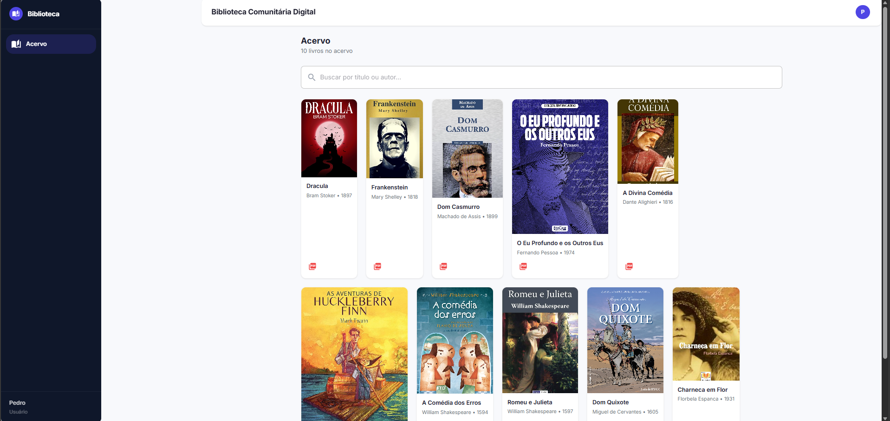

# 📚 Biblioteca Online — Java + React

Sistema web completo de gerenciamento e leitura de livros, desenvolvido como projeto pessoal para praticar desenvolvimento full stack com foco em arquitetura limpa, segurança e deploy em produção.

**Acesse:** https://biblioteca-java-react-1.onrender.com

---

## Funcionalidades

- Cadastro, autenticação e autorização de usuários (Spring Security + JWT)
- CRUD completo do acervo com upload de capa e PDF via Cloudinary
- Modo convidado com visualização do acervo (PDF bloqueado)
- Interface responsiva com tema moderno (indigo, Material 3)
- Sidebar com navegação, suporte a telas mobile (drawer)
- Cache busting de imagens para evitar capas duplicadas
- API documentada com Swagger

---

## Tecnologias

### Backend
- Java 17 + Spring Boot 3.5
- Spring Security + JWT + JPA/Hibernate
- PostgreSQL (Neon)
- Cloudinary (armazenamento de imagens e PDFs)
- Swagger (springdoc-openapi)

### Frontend
- React 19 + Vite 7
- MUI 7 (Material UI)
- React Router 6
- Axios

### Infraestrutura
- Render (deploy do backend com Docker e frontend como static site)
- Neon (PostgreSQL em nuvem)
- GitHub Actions (CI/CD)

---

## Demonstração

### Desktop

### Mobile

---

## Autor

**Rodrigo Mayer Alves**

---

## Licença

Projeto de uso livre para fins de estudo e aprendizado.
